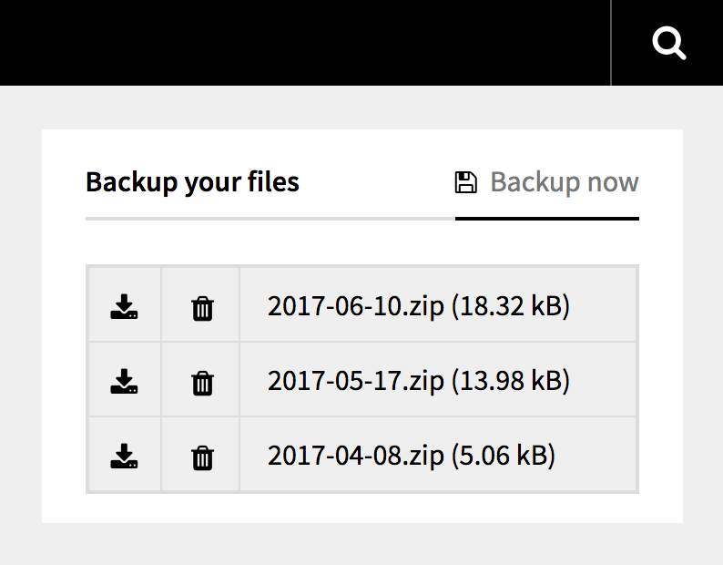

<h1 align="center">Kirby Backup Widget</h1>
<h3 align="center">Kirby panel widget to easily backup your site content.</h3>

<div align="center">
    
    
    
    <br>
    <br>
    
</div>

---


## Installation

Use one of the alternatives below.

### 1. Kirby CLI

If you are using the [Kirby CLI](https://github.com/getkirby/cli) you can install this plugin by running the following commands in your shell:

```sh
$ cd path/to/kirby
$ kirby plugin:install arnaudjuracek/kirby-backup-widget
```

### 2. Clone or download

1. [Clone](https://github.com/arnaudjuracek/kirby-backup-widget.git) or [download](https://github.com/arnaudjuracek/kirby-backup-widget/archive/master.zip)  this repository.
2. Unzip the archive if needed and rename the folder to `kirby-backup-widget`.

**Make sure that the plugin folder structure looks like this:**

```text
site/widgets/kirby-backup-widget/
```

### 3. Git Submodule

If you know your way around Git, you can download this plugin as a submodule:

```sh
$ cd path/to/kirby
$ git submodule add https://github.com/arnaudjuracek/kirby-backup-widget site/widgets/kirby-backup-widget
```

## Options

The following options can be set in your `/site/config/config.php` file:

---
### `widget.backup.include`
```php
c::set('widget.backup.include', ['projects', 'blog']);
```
+ **description**: array of folders to include from the backup. **Note that if you use `widget.backup.exclude`, all folders will be included no matter what you set in `widget.backup.include`.**
+ **default**: by default, all folders inside `content/` are included

---
### `widget.backup.exclude`
```php
c::set('widget.backup.exclude', ['error']);
```
+ **description**: array of folders to exclude from the backup. **Note that if used, `widget.backup.include` will be ignored.**
+ **default**: `[]`

---
### `widget.backup.include_site`
```php
c::set('widget.backup.include_site', false);
```
+ **description**: whether to include `content/site.txt` or not. Set this to `true` if you want to backup this file.
+ **default**: `false`

---
### `widget.backup.destination`
```php
c::set('widget.backup.destination', 'backups');
```
+ **description**: set the destination directory for the backup files. Accept subdirectory by using `'dir' . DS . 'subdir'`. Note that the directory will be placed in `content/` no matter what. This is mainly used to avoid collisions if you already have a directory called `backups` in `content/`. If the directory does not exist, it will be automatically created with `CHMOD 0777`. Finally, note that this backup directory will always be exluded, to avoid recursion.
+ **default**: `backups`

---
### `widget.backup.overwrite`
```php
c::set('widget.backup.overwrite', true);
```
+ **description**: set it to false if you don't want to allow backups overwrite. If set to `false` and a backup file with the same name already exists, the widget will show an alert error message.
+ **default**: `true`

---
### `widget.backup.date_format` 
```php
c::set('widget.backup.date_format', 'Y-m-d');
```
+ **description**: set the date format used to name the backup file. See [**function**.date.php](http://php.net/manual/function.date.php) for available formats.
+ **default**: `Y-m-d`
---

## Todo

- [ ] change basic url `?action=` parameters for a more robust widget [routing solution](https://getkirby.com/docs/developer-guide/toolkit/routing)
- [ ] add confirmation modal before deleting

## Changelog

**1.0**

- Initial release

## Requirements

- [**Kirby**](https://getkirby.com/) 2.0+

## Disclaimer

This plugin is provided "as is" with no guarantee. Use it at your own risk and always test it yourself before using it in a production environment. If you find any issues, please [create a new issue](https://github.com/arnaudjuracek/kirby-backup-widget/issues/new).

## License

[MIT](https://opensource.org/licenses/MIT)

It is discouraged to use this plugin in any project that promotes racism, sexism, homophobia, animal abuse, violence or any other form of hate speech.
